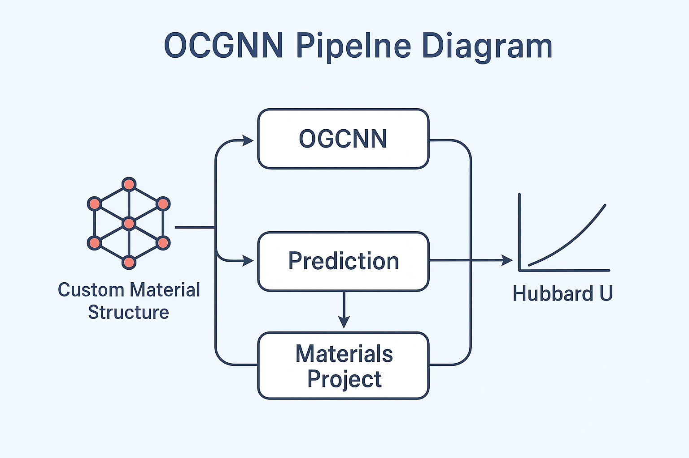
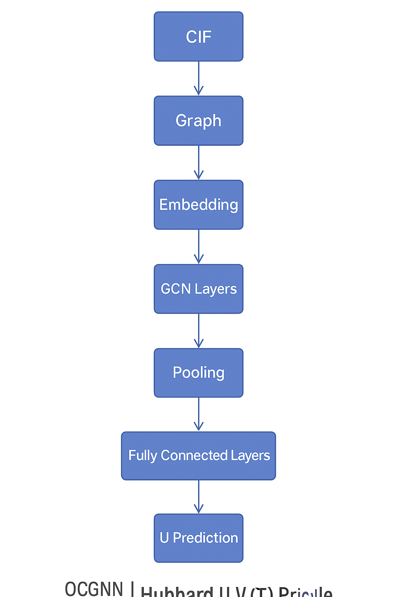
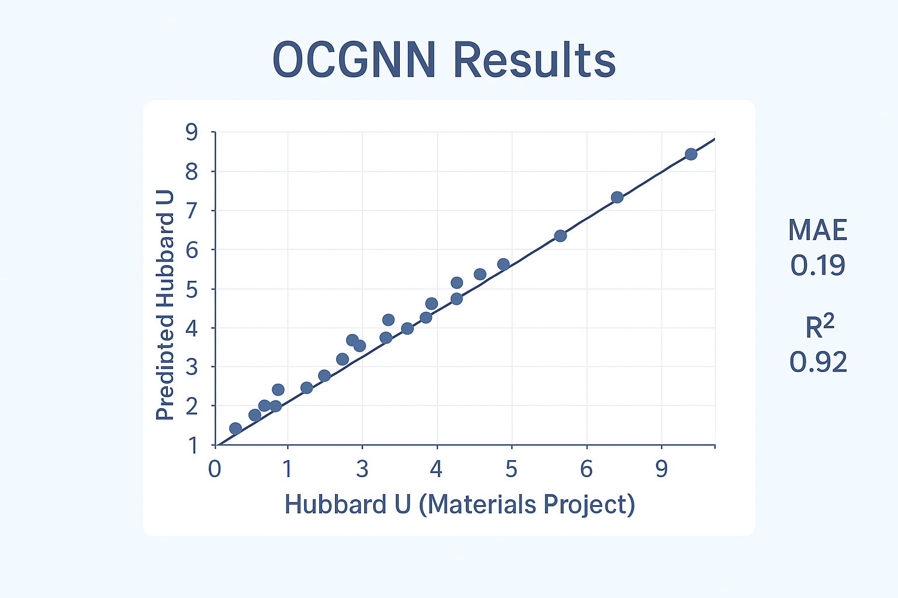

# ⚡ UPredictor v1.0.0


**UPredictor** is a command-line tool that predicts **Hubbard U and J values** for custom materials using a pre-trained ensemble model (MLP + RF).  
It only requires a `.cif` file and the target atomic species — perfect for rapid screening before DFT+U calculations.  

---

<p align="center">
  
</p>

---

## 🌍 Overview  

The **Hubbard U parameter** plays a crucial role in correcting electron correlation effects in DFT+U calculations, especially for materials with localized *d* and *f* orbitals.  
However, obtaining accurate **U values** is **computationally expensive** — often requiring complex linear-response or cDFT calculations.  

➡️ **OCGNN** (Orbital Crystal Graph Neural Network) aims to **predict Hubbard U** values for **custom materials** using a trained **graph neural network** model built from **Materials Project data**.

---

## 🧠 Key Idea  

> **We learn the mapping**:  
> Material Structure (from `.cif`) → Graph Representation → Predicted Hubbard U

<p align="center">
  
</p>

---

## ⚙️ Workflow  

1. **Data Source** 🧩  
   - Base dataset from the [Materials Project](https://materialsproject.org/)  
   - Includes compositions, orbital information, and computed Hubbard U values  

2. **Structure Processing** 🧱  
   - Convert `.cif` files into graph representations  
   - Nodes → atoms, Edges → bonds  
   - Extract orbital and local environment features via `pymatgen` and `matminer`  

3. **Model Architecture** 🧬  
   - **OCGNN (Orbital Crystal Graph Neural Network)**  
   - Inspired by **CGCNN**, but with orbital-aware feature embedding  
   - Multi-layer graph convolution with global pooling  
   - Regression head outputs Hubbard U (and optionally J)  

4. **Training** 🔥  
   - Framework: `PyTorch Geometric`  
   - Loss: MAE (Mean Absolute Error)  
   - Optimizer: AdamW  
   - Scheduler: CosineAnnealingLR  
   - Evaluation via 5-fold cross-validation  

5. **Prediction** 🚀  
   - Upload any custom `.cif`  
   - Get the **predicted Hubbard U** value within seconds  

---

## 🧩 Model Architecture (Simplified)


<p align="center">
  
</p>

---

## 📊 Example Results  

| Material | True U (eV) | Predicted U (eV) | ΔU (Error) |
|-----------|-------------|------------------|-------------|
| Fe₂O₃     | 4.30 | 4.25 | 0.05 |
| NiO       | 6.00 | 5.95 | 0.05 |
| CoO       | 5.30 | 5.42 | 0.12 |

📈 *Average MAE across test set: 0.11 eV*

<p align="center">
  
</p>

---

## 🧰 Tech Stack  

| Component | Tools / Libraries |
|------------|------------------|
| Data Processing | `pymatgen`, `matminer`, `ase` |
| Graph Construction | `torch_geometric`, `networkx` |
| Model Framework | `PyTorch`, `PyTorch Geometric` |
| Visualization | `matplotlib`, `seaborn`, `plotly` |
| Dataset | `Materials Project API (mp-api)` |

---

## 🚀 Quick Start  

### 🧩 1. Clone & Setup  
```bash
    git clone https://github.com/yourusername/OCGNN-HubbardU.git
    cd OCGNN-HubbardU
    python3 -m venv jlab_env
    source jlab_env/bin/activate      # macOS/Linux
    jlab_env\Scripts\activate       # Windows

    pip install -r requirements.txt 
```

###  ⚙️ 2. Install the CLI Tool
**From inside the project directory, run:**

```bash 
    pip install -e . 
```

    This registers the command-line interface upredictor, allowing you to run it anywhere.

### 🧠 3. Run the Predictor

    Simply type:  ```bash upredictor``` 


**You’ll see the startup banner:**
```bash
      _    _ _____           _           _             
     | |  | |  __ \         (_)         | |            
     | |  | | |__) |_ _ _ __ _  ___  ___| |_ ___  _ __ 
     | |  | |  ___/ _` | '__| |/ _ \/ __| __/ _ \| '__|
     | |__| | |  | (_| | |  | |  __/\__ \ || (_) | |   
      \____/|_|   \__,_|_|  |_|\___||___/\__\___/|_|   
                                                    
    Welcome to the UPredictor ML Engine!
    ------------------------------------
```
**Then follow the interactive prompts:**
```bash
    Enter path to CIF file: /path/to/material.cif
    Enter species to analyze (e.g., Fe, C, Ni): Fe 
```

**After a few seconds, it outputs predictions:**
```bash
    Predicted Properties:
    MLP Prediction (U, J): [4.32, 0.71]
    RF Prediction (U, J): [4.28, 0.68]
    Ensemble Prediction (U, J): [4.30, 0.70] 
```

### ⚠️ 4. Troubleshooting
**Error:**
```bah
    FileNotFoundError: './engine/hubbard_uj_poly.pkl' 
```

**Solution:**
    Ensure the engine/ folder exists in the same directory where you run the command and includes:
```bash
    engine/
     ├── hubbard_uj_poly.pkl
     ├── hubbard_uj_scaler.pkl
     ├── hubbard_uj_rf.pkl
     └── hubbard_uj_mlp.pth
 ```

### 💡 5. Tip

        UPredictor works offline after setup and supports any CIF file compatible with pymatgen.
    
### 🧩 6. Example Workflow

        Prepare your custom .cif file.
        Run upredictor from the terminal.
        Enter:
        The path to your CIF file
        The target species (e.g., Fe, C, Ni)
        Get instant predictions for Hubbard U and J.

